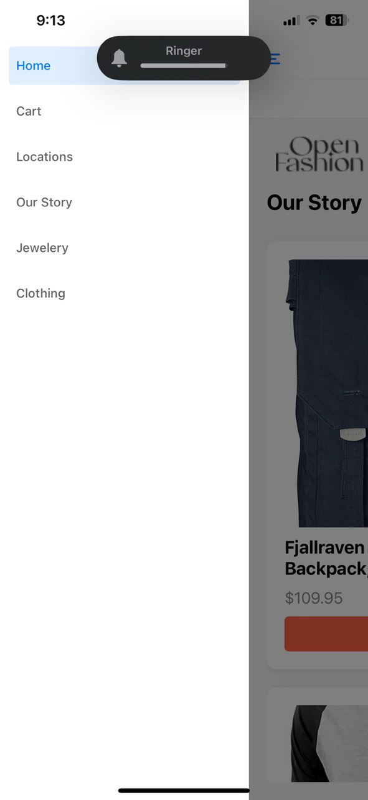
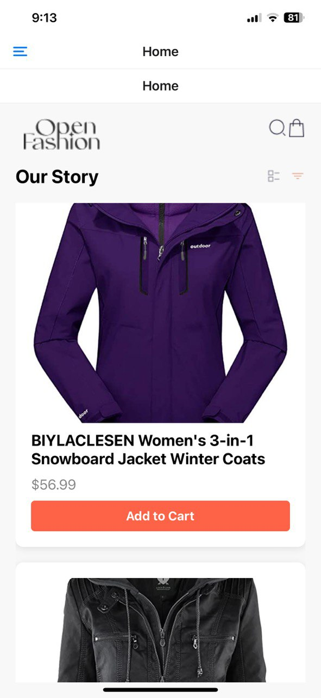
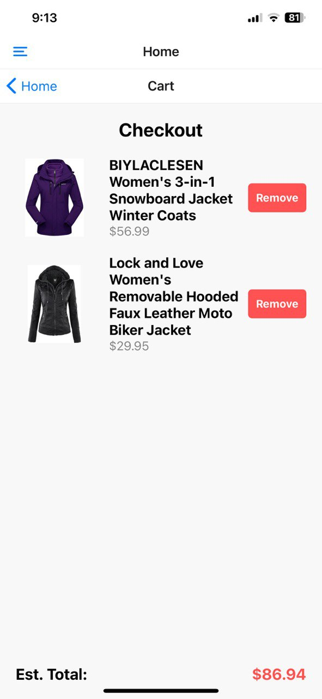
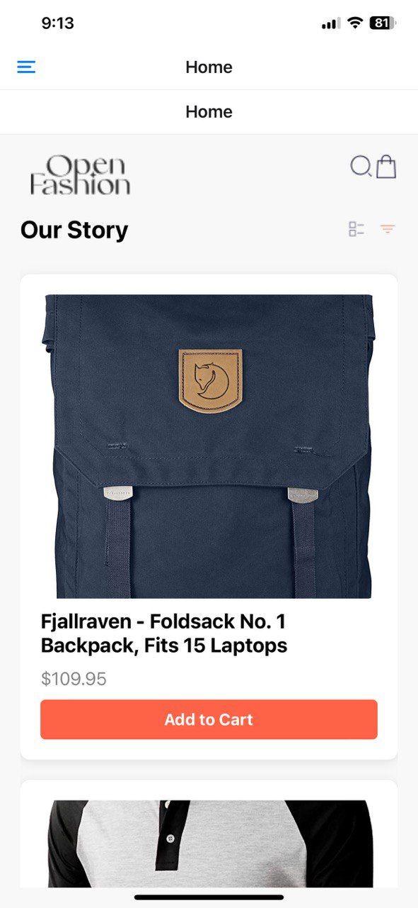
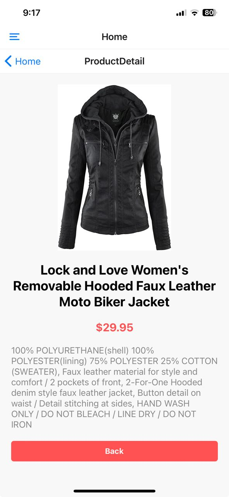

## Dress E-Commerce App
## Overview
This project is an academic e-commerce application for dresses, developed using React Native with Expo. It consists of two primary screens: the Home Page and the Cart Screen.
## StudentID
1137328
## Features
Home Page: Displays a list of dresses available for purchase, including images, names, and prices.
Cart Screen: Shows the items added to the cart, allowing users to view their selected items and proceed to checkout.
ProductDetailScreen: shows detailed information about an item selected
Drawer csreen: shows a side nav bar of theh screens.
## Technologies Used
React Native: A framework for building native apps using React.
Expo: A framework and platform for universal React applications.
## Installation
Clone the repository from your GitHub account.
Navigate to the project directory.
Install the necessary dependencies using npm.
Running the Project
Start the Expo development server using the appropriate command.
Scan the QR code with the Expo Go app on your mobile device to view the app.
## Usage
On the Home Page, users can browse through a selection of dresses.
Items can be added to the cart by selecting the desired dress.
The Cart Screen displays all the items added to the cart, where users can review their selections and proceed to checkout.
## Contributions
Contributions to this project are welcome. Please follow the standard GitHub workflow for contributing:
## Fork the repository.
Create a new branch for your feature or bug fix.
Make your changes and commit them with descriptive messages.
Push your changes to your fork.
Submit a pull request to the main repository.
## Screenshots
 
 
 
 
